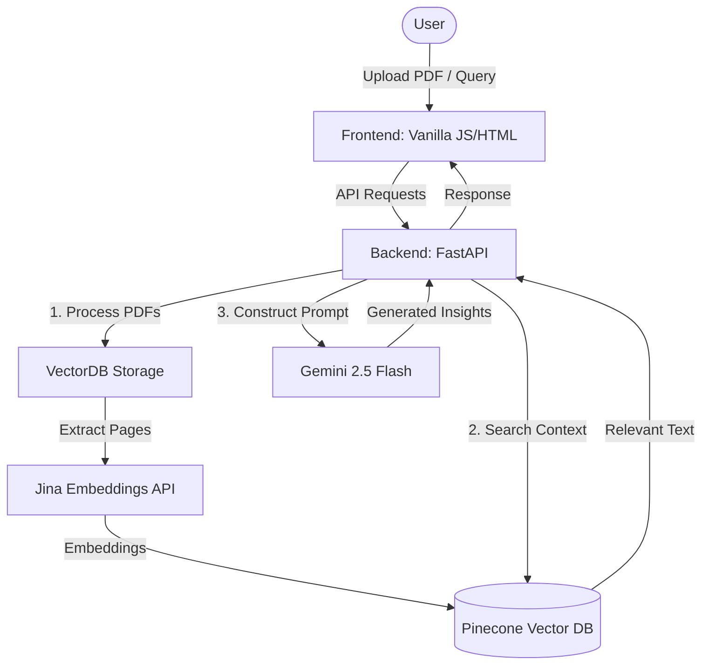

# 📊 FinBrain — AI Financial Analyst

FinBrain is an AI-powered financial document analysis tool that distills insights from earnings reports, investor call transcripts, and financial statements into actionable summaries.

It fuses **Retrieval-Augmented Generation (RAG)** with **Pinecone** for high-performance vector search and leverages **Gemini 2.5 Flash** to generate structured financial intelligence.

Built with **FastAPI** for a robust backend and **Vanilla JS/HTML** for an intuitive interface, and containerized with **Docker**, FinBrain makes it effortless to upload PDFs, query them, and extract deep financial insights — all within seconds.

---

## 🚀 Demo

Live Demo(Limited API credits) : https://finbrain.streamlit.app/

Watch the demo : https://www.loom.com/share/2264c7d9bae844ff8d9ea22fd06fe25a?sid=60dc4659-647d-48ec-b4a6-9df2b8fe9a0c

---

## 🧠 How It Works

### Architecture



### 1. Document Ingestion & Vectorization
- Upload PDFs of financial reports.
- Each page is extracted and embedded using `jina-embeddings-v2-base-en` via **Jina Embeddings API**.
- Embeddings are stored in **Pinecone** under company-specific payloads.

### 2. Vector Search
- Query terms like `"revenue, EBITDA, profit"` search the vector DB for semantically similar paragraphs.

### 3. AI-Powered Summarization
- Gemini 2.5 Flash processes top-matching results and generates a structured summary (e.g., financial tables).

---

## 🧩 Tech Stack

| Layer        | Technology                                |
|--------------|--------------------------------------------|
| Frontend     | Vanilla HTML/JS/CSS                        |
| Backend API  | FastAPI                                    |
| Embeddings   | Jina Embeddings API (`jina-embeddings-v2-base-en`)|
| Vector DB    | Pinecone                                   |
| LLM API      | Gemini 2.5 Flash                           |
| Parsing PDFs | PyMuPDF (`fitz`)                           |
| Container    | Docker                                     |

---

## 📦 Local Setup

### Prerequisites

- Python 3.9+
- Docker
- Gemini API Key (set in `.env` as `API_KEY`)
- Jina API Key (set in `.env` as `JINA_API_KEY`)

### 1. Clone the Repository

```bash
git clone https://github.com/Shashwat-Akhilesh-Shukla/FinBrain.git
cd FinBrain
````

### 2. Configure Environment Variables

Create a `.env` file with the following:

```env
API_KEY=your_gemini_api_key_here
JINA_API_KEY=your_jina_api_key_here
```

### 3. One Command run:-

```bash
docker compose up --build
```

## 🧪 Example Workflow

1. Upload multiple PDFs of company earnings reports.
2. Click **"Process PDFs"** — vectors are stored in Pinecone.
3. Enter a semantic query like `"net profit"`.
4. Customize the AI prompt or use the default.
5. Click **"Get Financial Insights"** and get a structured, AI-generated summary.

---

## 🔍 Example Use Cases

* **Investor Research**: Pull out financial KPIs in seconds.
* **Competitive Intelligence**: Compare performance metrics across firms.
* **Earnings Call Highlights**: Summarize long transcripts instantly.
* **Due Diligence**: Rapidly assess financial health for investment.

---

## 🗂 Directory Structure

```
.
├── app.py                # FastAPI backend & API endpoints
├── llmintegration.py     # Script to test LLM response separately
├── vectordb_storage.py   # Pinecone integration and PDF processing
├── static/               # Frontend assets (HTML, CSS, JS)
├── data/                 # Uploaded PDF storage
├── .env                  # API key config
├── requirements.txt
└── Dockerfile (coming soon)
```

---

## 🤝 Contributing

Open to PRs!
Fix something, improve the UX, or optimize the AI prompt chaining — but don’t bloat the repo.

---

## 🛡 License

MIT License — Use freely. Break it, fork it, profit from it.
